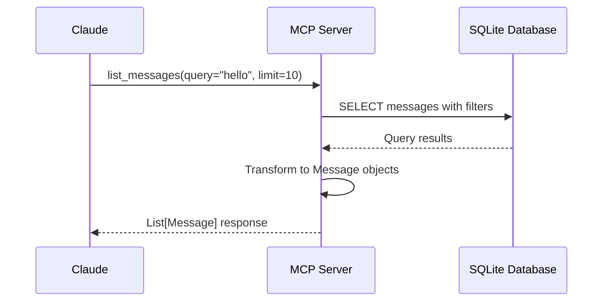
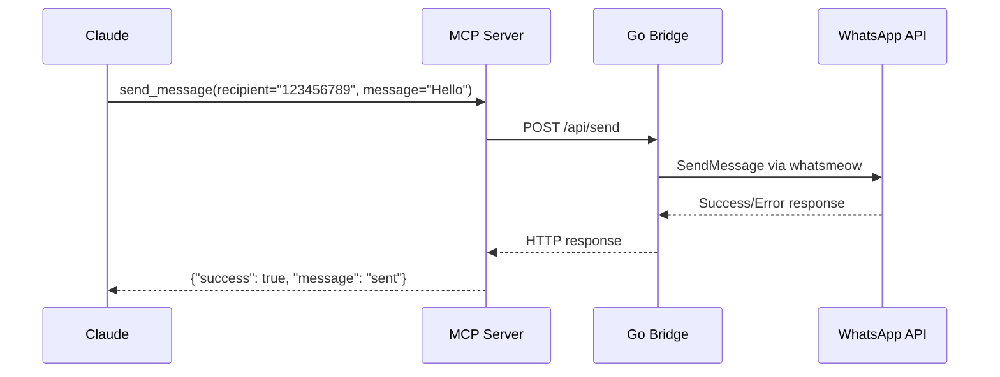
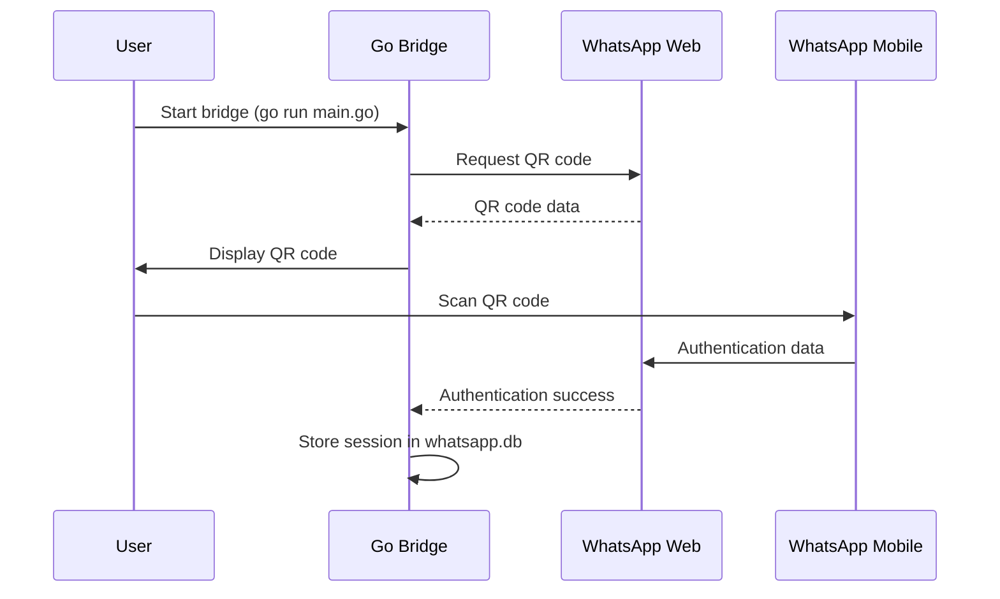
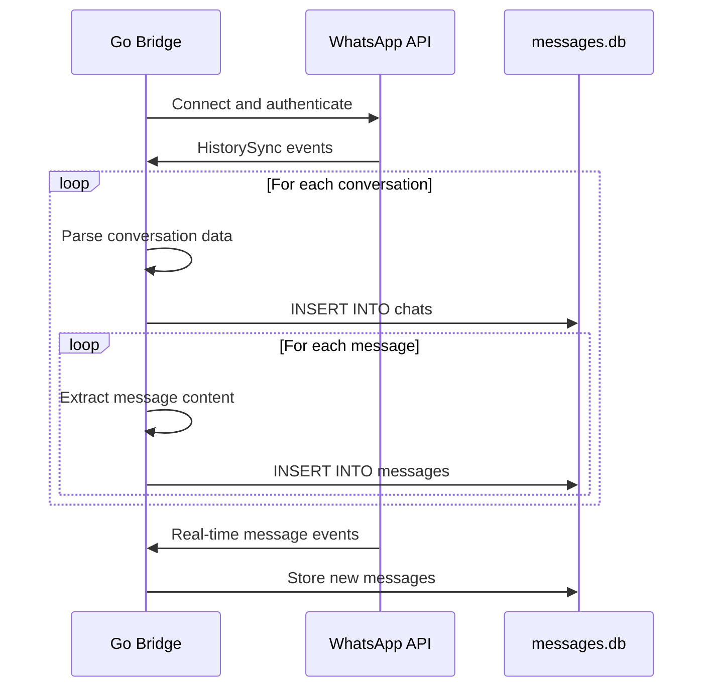
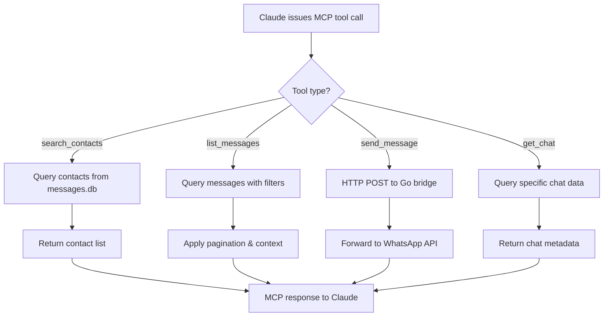

# WhatsApp MCP Server - Architecture Documentation

## Table of Contents
1. [Project Overview](#project-overview)
2. [High Level Design (HLD)](#high-level-design-hld)
3. [Low Level Design (LLD)](#low-level-design-lld)
4. [Flow Diagrams](#flow-diagrams)
5. [Database Schema](#database-schema)
6. [API Documentation](#api-documentation)
7. [Security Considerations](#security-considerations)
8. [Deployment Architecture](#deployment-architecture)

## Project Overview

The WhatsApp MCP Server is a **Model Context Protocol (MCP)** implementation that enables AI assistants like Claude to interact with personal WhatsApp accounts. It provides a secure bridge between AI agents and WhatsApp's web API, allowing message retrieval, contact search, and message sending capabilities.

### Key Features
- **Personal WhatsApp Integration**: Direct connection via WhatsApp Web multidevice API
- **Local Data Storage**: SQLite database for message history and metadata
- **MCP Protocol Support**: Standard interface for AI assistant integration
- **Real-time Messaging**: Bidirectional communication capabilities
- **Contact Management**: Search and manage WhatsApp contacts
- **Message Context**: Retrieve conversation context and history

## High Level Design (HLD)

### System Architecture

```
┌─────────────────┐    ┌─────────────────┐    ┌─────────────────┐
│   AI Assistant  │    │  MCP Server     │    │ WhatsApp Bridge │
│   (Claude)      │◄──►│  (Python)       │◄──►│    (Go)         │
└─────────────────┘    └─────────────────┘    └─────────────────┘
                                │                       │
                                │                       │
                                ▼                       ▼
                       ┌─────────────────┐    ┌─────────────────┐
                       │  MCP Protocol   │    │  WhatsApp API   │
                       │   (stdio/TCP)   │    │   (whatsmeow)   │
                       └─────────────────┘    └─────────────────┘
                                                       │
                                                       ▼
                                              ┌─────────────────┐
                                              │  SQLite DBs     │
                                              │ - messages.db   │
                                              │ - whatsapp.db   │
                                              └─────────────────┘
```

### Component Overview

#### 1. **AI Assistant Layer (Claude/Cursor)**
- Consumes MCP protocol for WhatsApp interactions
- Issues tool calls for message operations
- Processes WhatsApp data for intelligent responses

#### 2. **MCP Server (Python)**
- **Purpose**: Protocol adapter and business logic layer
- **Technology**: Python 3.11+ with FastMCP framework
- **Responsibilities**:
  - Implements MCP protocol specification
  - Exposes WhatsApp operations as MCP tools
  - Handles data transformation and validation
  - Provides unified API for all WhatsApp operations

#### 3. **WhatsApp Bridge (Go)**
- **Purpose**: WhatsApp API integration and data persistence
- **Technology**: Go 1.24+ with whatsmeow library
- **Responsibilities**:
  - Maintains WhatsApp Web connection
  - Handles authentication (QR code pairing)
  - Processes real-time message events
  - Stores messages and chat metadata
  - Provides REST API for message sending

#### 4. **Data Layer**
- **messages.db**: Message history and chat metadata
- **whatsapp.db**: WhatsApp session and device information

### Data Flow Architecture

```
┌─────────────┐   MCP Request    ┌─────────────┐   SQLite Query   ┌─────────────┐
│             │ ──────────────► │             │ ──────────────► │             │
│   Claude    │                 │ MCP Server  │                 │  Database   │
│             │ ◄────────────── │             │ ◄────────────── │             │
└─────────────┘   MCP Response  └─────────────┘   Query Result  └─────────────┘
                                        │
                                        │ HTTP Request
                                        ▼
                                ┌─────────────┐   WhatsApp API   ┌─────────────┐
                                │             │ ──────────────► │             │
                                │ Go Bridge   │                 │ WhatsApp    │
                                │             │ ◄────────────── │   Server    │
                                └─────────────┘   WebSocket     └─────────────┘
```

## Low Level Design (LLD)

### MCP Server Architecture (`whatsapp-mcp-server/`)

#### Core Components

```python
# main.py - MCP Server Entry Point
FastMCP("whatsapp")
├── @mcp.tool() decorators
├── Tool implementations
└── Server initialization

# whatsapp.py - Business Logic Layer
├── Data Models (Message, Chat, Contact, MessageContext)
├── Database Operations
├── REST API Client
└── Utility Functions
```

#### Data Models

```python
@dataclass
class Message:
    timestamp: datetime
    sender: str
    content: str
    is_from_me: bool
    chat_jid: str
    id: str
    chat_name: Optional[str] = None

@dataclass
class Chat:
    jid: str
    name: Optional[str]
    last_message_time: Optional[datetime]
    last_message: Optional[str] = None
    last_sender: Optional[str] = None
    last_is_from_me: Optional[bool] = None

@dataclass
class Contact:
    phone_number: str
    name: Optional[str]
    jid: str
```

#### MCP Tools Implementation

| Tool | Purpose | Parameters | Return Type |
|------|---------|------------|-------------|
| `search_contacts` | Find contacts by name/phone | `query: str` | `List[Contact]` |
| `list_messages` | Retrieve messages with filters | `date_range, sender, chat_jid, query, limit, page` | `List[Message]` |
| `list_chats` | Get available chats | `query, limit, page, include_last_message` | `List[Chat]` |
| `get_chat` | Get specific chat details | `chat_jid, include_last_message` | `Chat` |
| `send_message` | Send WhatsApp message | `recipient, message` | `Dict[str, Any]` |

### WhatsApp Bridge Architecture (`whatsapp-bridge/`)

#### Core Components

```go
// main.go - WhatsApp Bridge Entry Point
main()
├── Database initialization (MessageStore)
├── WhatsApp client setup (whatsmeow)
├── Event handlers registration
├── REST API server startup
└── Connection lifecycle management

// Key Structures
type MessageStore struct {
    db *sql.DB
}

type Message struct {
    Time     time.Time
    Sender   string
    Content  string
    IsFromMe bool
}
```

#### Event Handling System

```go
client.AddEventHandler(func(evt interface{}) {
    switch v := evt.(type) {
    case *events.Message:
        handleMessage(client, messageStore, v, logger)
    case *events.HistorySync:
        handleHistorySync(client, messageStore, v, logger)
    case *events.Connected:
        // Handle connection events
    case *events.LoggedOut:
        // Handle logout events
    }
})
```

#### REST API Endpoints

| Endpoint | Method | Purpose | Request Body | Response |
|----------|--------|---------|--------------|----------|
| `/api/send` | POST | Send message | `{"recipient": "...", "message": "..."}` | `{"success": bool, "message": "..."}` |

### Database Layer Design

#### Connection Management
```python
# Python side - Read operations
MESSAGES_DB_PATH = "../whatsapp-bridge/store/messages.db"
conn = sqlite3.connect(MESSAGES_DB_PATH)

# Go side - Write operations  
db, err := sql.Open("sqlite3", "file:store/messages.db?_foreign_keys=on")
```

#### Query Patterns
- **Complex filtering**: Date ranges, content search, sender filtering
- **Pagination**: Offset-based pagination for large result sets
- **Context retrieval**: Messages before/after specific message IDs
- **Relationship queries**: JOIN operations between chats and messages

## Flow Diagrams

### 1. Message Retrieval Flow



### 2. Message Sending Flow



### 3. WhatsApp Authentication Flow



### 4. Message History Sync Flow



### 5. MCP Tool Execution Flow



## Database Schema

### messages.db Schema

```sql
-- Chat metadata table
CREATE TABLE chats (
    jid TEXT PRIMARY KEY,                -- WhatsApp JID (unique identifier)
    name TEXT,                          -- Chat/contact name
    last_message_time TIMESTAMP         -- Last activity timestamp
);

-- Message content table
CREATE TABLE messages (
    id TEXT,                           -- Message ID from WhatsApp
    chat_jid TEXT,                     -- Foreign key to chats.jid
    sender TEXT,                       -- Sender's phone number/JID
    content TEXT,                      -- Message text content
    timestamp TIMESTAMP,               -- Message timestamp
    is_from_me BOOLEAN,               -- True if sent by current user
    PRIMARY KEY (id, chat_jid),       -- Composite primary key
    FOREIGN KEY (chat_jid) REFERENCES chats(jid)
);

-- Indexes for performance
CREATE INDEX idx_messages_timestamp ON messages(timestamp);
CREATE INDEX idx_messages_chat_jid ON messages(chat_jid);
CREATE INDEX idx_messages_content ON messages(content);
CREATE INDEX idx_chats_last_message_time ON chats(last_message_time);
```

### whatsapp.db Schema (managed by whatsmeow)

```sql
-- Device session information
CREATE TABLE whatsmeow_device (
    jid TEXT PRIMARY KEY,
    registration_id INTEGER,
    noise_key BLOB,
    identity_key BLOB,
    signed_pre_key BLOB,
    signed_pre_key_id INTEGER,
    signed_pre_key_sig BLOB,
    adv_key BLOB,
    adv_details BLOB,
    adv_account_sig BLOB,
    adv_account_sig_key BLOB,
    adv_device_sig BLOB,
    platform TEXT,
    business_name TEXT,
    push_name TEXT
);

-- Contact information
CREATE TABLE whatsmeow_contacts (
    our_jid TEXT,
    their_jid TEXT,
    first_name TEXT,
    full_name TEXT,
    push_name TEXT,
    business_name TEXT,
    PRIMARY KEY (our_jid, their_jid)
);

-- Chat settings and metadata
CREATE TABLE whatsmeow_chat_settings (
    our_jid TEXT,
    chat_jid TEXT,
    muted_until INTEGER,
    pinned INTEGER,
    archived INTEGER,
    PRIMARY KEY (our_jid, chat_jid)
);
```

## API Documentation

### MCP Tools API

#### search_contacts
```python
def search_contacts(query: str) -> List[Dict[str, Any]]
```
- **Purpose**: Search contacts by name or phone number
- **Parameters**: 
  - `query`: Search term for contact name or phone
- **Returns**: List of contact dictionaries with `phone_number`, `name`, `jid`

#### list_messages
```python
def list_messages(
    date_range: Optional[Tuple[datetime, datetime]] = None,
    sender_phone_number: Optional[str] = None,
    chat_jid: Optional[str] = None,
    query: Optional[str] = None,
    limit: int = 20,
    page: int = 0,
    include_context: bool = True,
    context_before: int = 1,
    context_after: int = 1
) -> List[Dict[str, Any]]
```
- **Purpose**: Retrieve messages with flexible filtering
- **Parameters**:
  - `date_range`: Start and end datetime for filtering
  - `sender_phone_number`: Filter by specific sender
  - `chat_jid`: Filter by specific chat
  - `query`: Text search within message content
  - `limit`: Maximum messages to return
  - `page`: Page number for pagination
  - `include_context`: Include surrounding messages
  - `context_before/after`: Number of context messages

#### send_message
```python
def send_message(recipient: str, message: str) -> Dict[str, Any]
```
- **Purpose**: Send WhatsApp message
- **Parameters**:
  - `recipient`: Phone number (e.g., "1234567890") or JID (e.g., "1234567890@s.whatsapp.net")
  - `message`: Text message content
- **Returns**: Success status and message

### REST API (Go Bridge)

#### POST /api/send
```json
Request:
{
    "recipient": "1234567890",
    "message": "Hello World"
}

Response:
{
    "success": true,
    "message": "Message sent to 1234567890"
}
```

## Security Considerations

### Data Protection
1. **Local Storage Only**: All messages stored locally in SQLite
2. **No Cloud Transmission**: Data only sent to AI when explicitly requested
3. **File System Permissions**: Database files secured with appropriate permissions
4. **Session Management**: WhatsApp sessions encrypted by whatsmeow library

### Authentication Security
1. **QR Code Pairing**: Standard WhatsApp Web authentication
2. **Device Registration**: Secure device key exchange
3. **Session Persistence**: Encrypted session storage
4. **Auto-logout**: Session expiry after ~20 days

### Network Security
1. **Local Communication**: MCP and REST API operate on localhost
2. **HTTPS**: WhatsApp API uses encrypted connections
3. **No External APIs**: No third-party services involved
4. **Firewall Friendly**: Only outbound connections to WhatsApp servers

### Privacy Considerations
1. **Explicit Control**: User controls what data is shared with AI
2. **Tool-based Access**: AI can only access data through defined tools
3. **Audit Trail**: All MCP tool calls are logged
4. **User Consent**: Clear understanding of data access patterns

## Deployment Architecture

### Development Setup
```
📁 whatsapp-mcp/
├── 📁 whatsapp-bridge/          # Go application
│   ├── main.go                  # Entry point
│   ├── go.mod                   # Dependencies
│   └── 📁 store/               # Database files
│       ├── messages.db          # Message history
│       └── whatsapp.db         # Session data
└── 📁 whatsapp-mcp-server/     # Python MCP server
    ├── main.py                  # MCP entry point
    ├── whatsapp.py             # Business logic
    └── pyproject.toml          # Python dependencies
```

### Runtime Architecture
```
Process 1: Go Bridge
├── WhatsApp Web connection (WebSocket)
├── SQLite database operations
├── REST API server (port 8080)
└── Message event processing

Process 2: Python MCP Server
├── MCP protocol handler (stdio)
├── Database read operations
├── HTTP client for Go bridge
└── AI assistant communication
```

### Claude Desktop Integration
```json
{
  "mcpServers": {
    "whatsapp": {
      "command": "/path/to/uv",
      "args": [
        "--directory", "/path/to/whatsapp-mcp-server",
        "run", "main.py"
      ]
    }
  }
}
```

### System Requirements
- **Go**: 1.24+ with CGO enabled (for SQLite)
- **Python**: 3.11+ with UV package manager
- **SQLite**: 3.x for data storage
- **WhatsApp**: Mobile app for QR code authentication
- **Network**: Internet connection for WhatsApp API

### Monitoring and Logging
- **Go Bridge**: Structured logging with zerolog
- **MCP Server**: Python logging for tool calls
- **WhatsApp Events**: Real-time message event logging
- **Error Handling**: Graceful degradation and error reporting

---

This architecture documentation provides a comprehensive overview of the WhatsApp MCP Server system, covering both high-level design principles and low-level implementation details. The modular architecture ensures maintainability, security, and scalability while providing a robust integration between AI assistants and WhatsApp messaging. 