# WhatsApp MCP Server - Flow Diagrams

This document contains detailed flow diagrams for the WhatsApp MCP Server system, illustrating various processes and interactions.

## System Overview Diagram

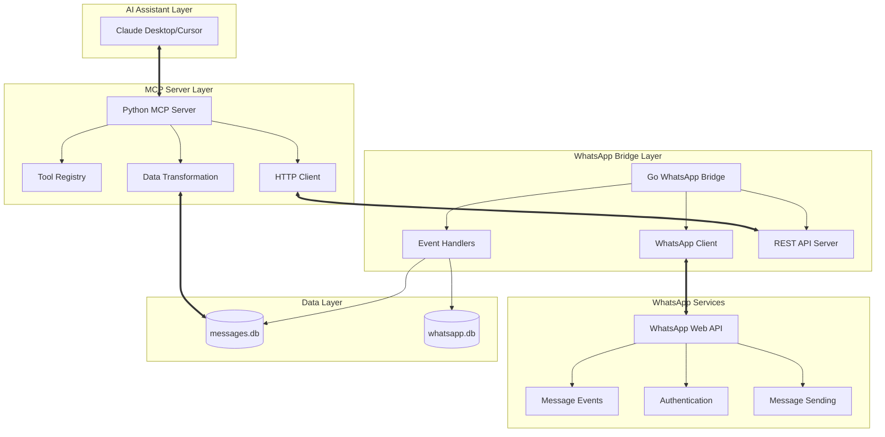

## 1. System Initialization Flow

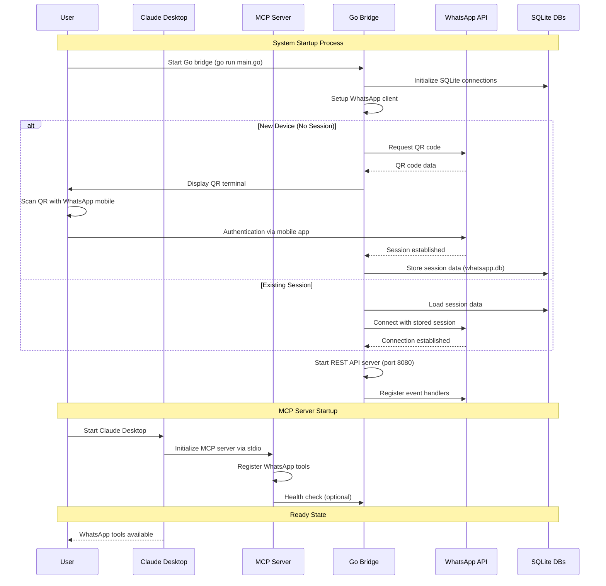

## 2. Message Retrieval Flow (Detailed)

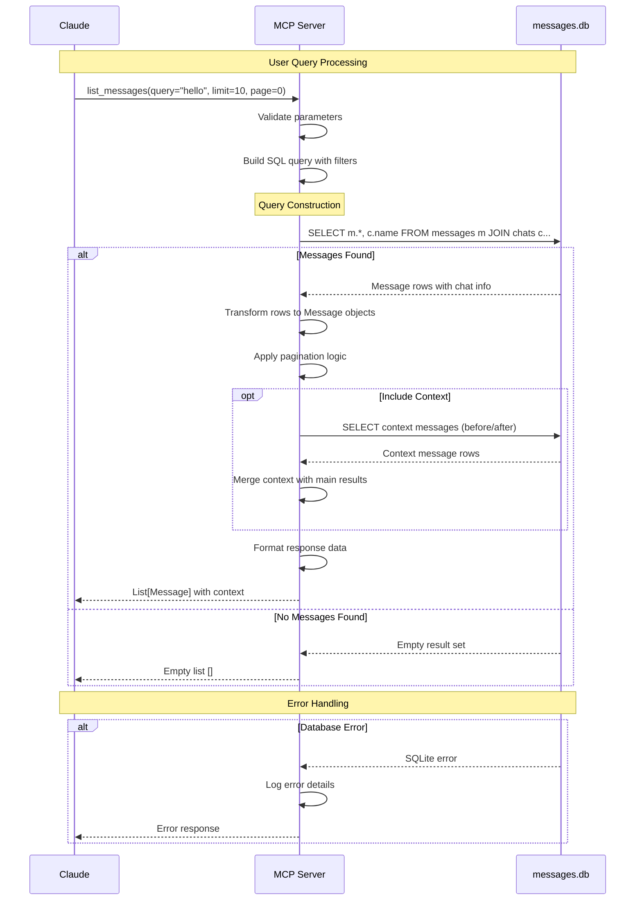

## 3. Message Sending Flow (Detailed)

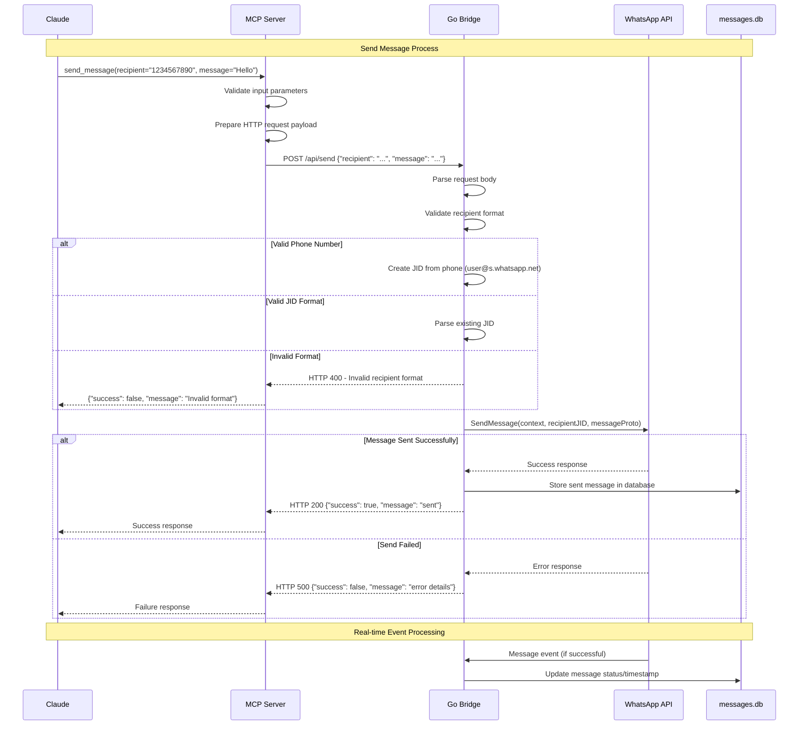

## 4. WhatsApp Event Processing Flow

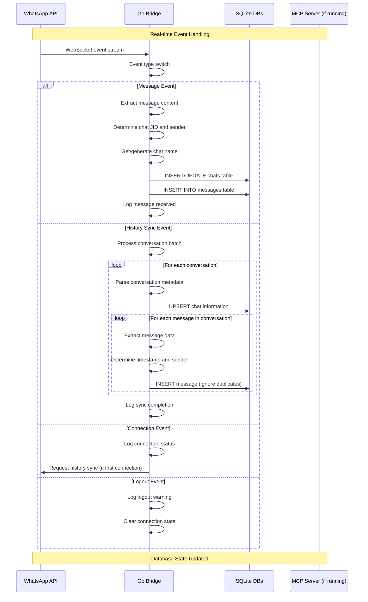

## 5. Contact Search Flow

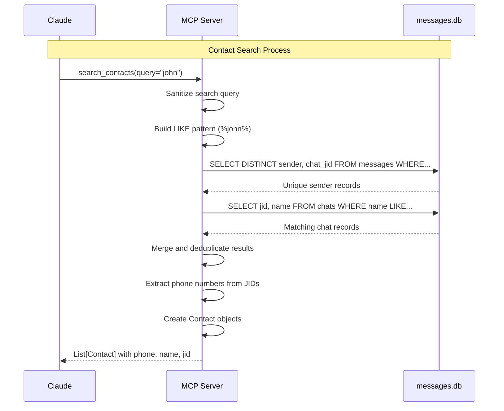

## 6. Chat Management Flow

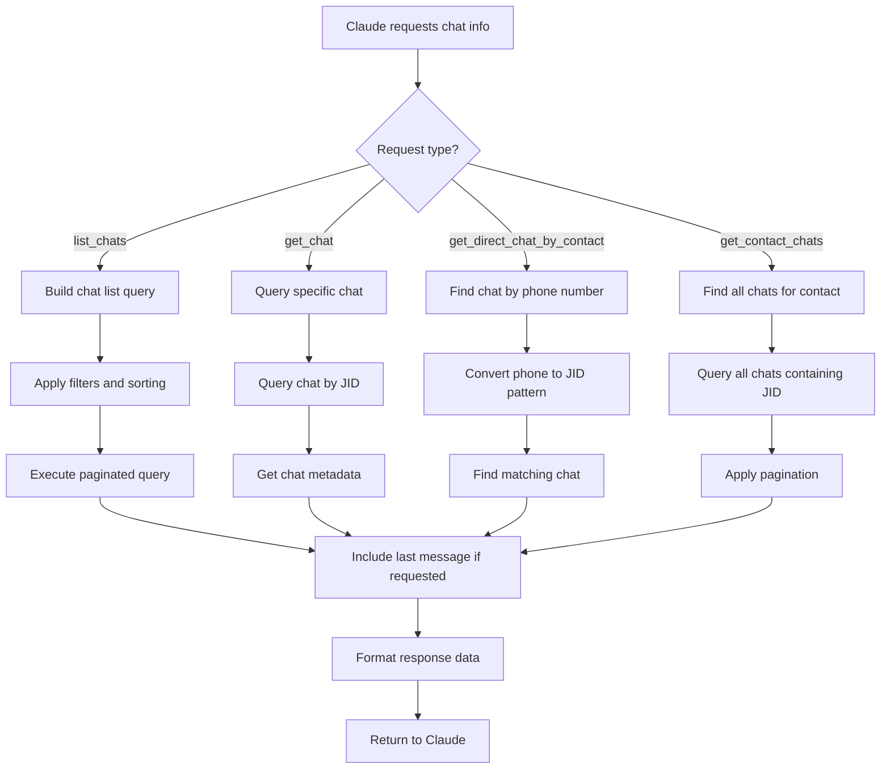

## 7. Database Transaction Flow

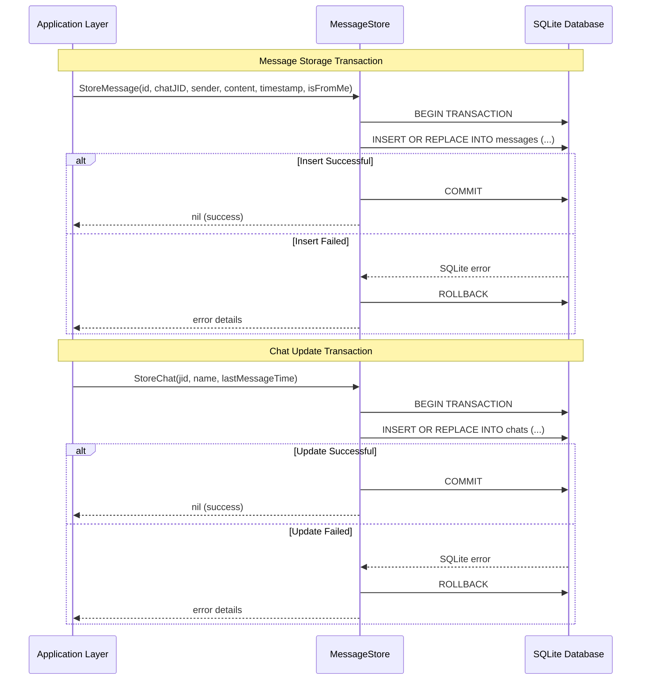

## 8. Error Handling Flow

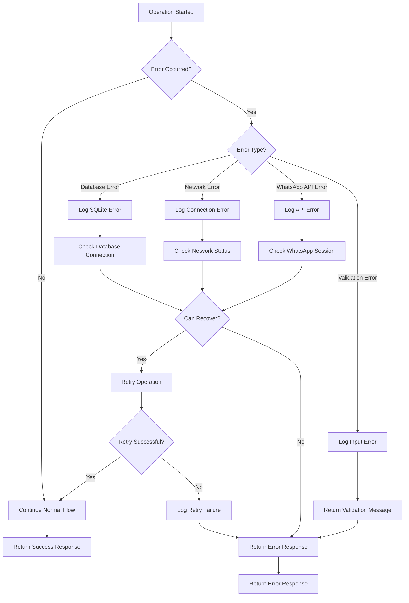

## 9. Authentication State Flow

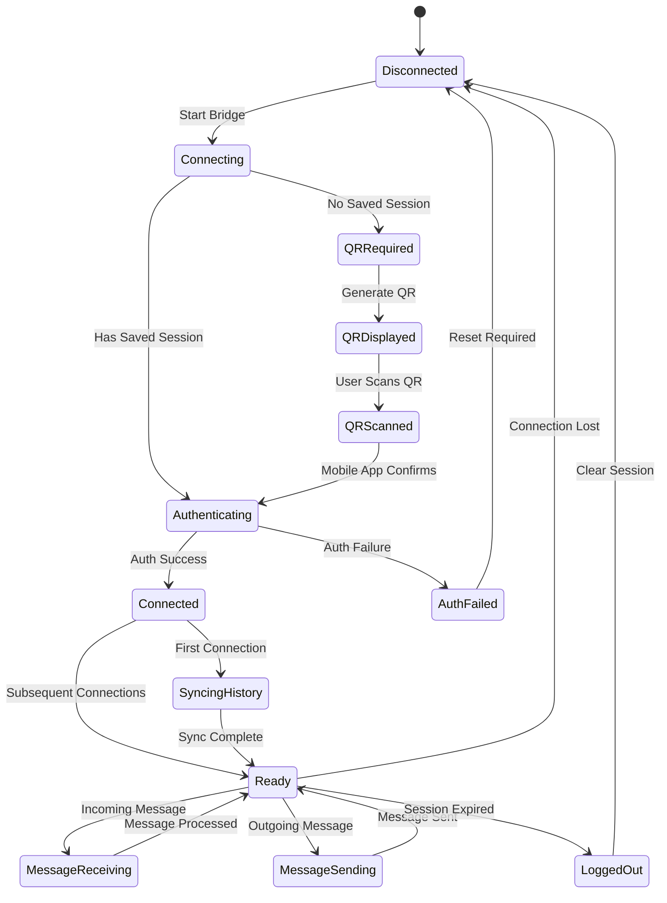

## 10. Data Synchronization Flow

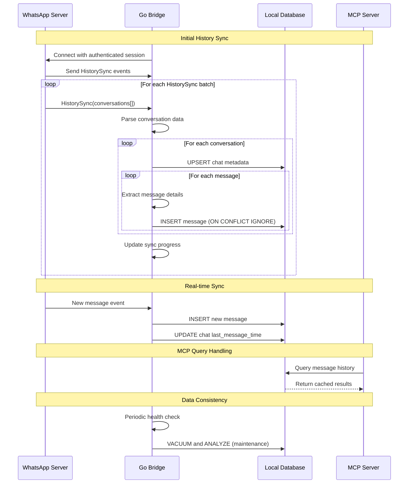

This comprehensive set of flow diagrams illustrates the complete operational behavior of the WhatsApp MCP Server system, from initialization through various operational scenarios and error conditions. 